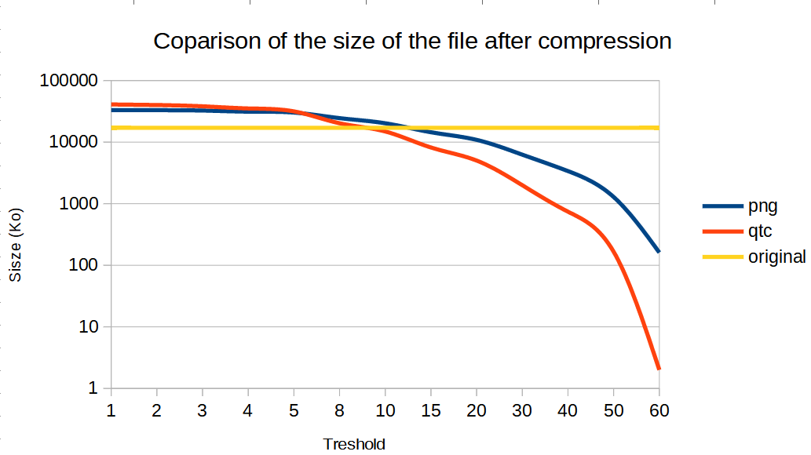

# Quadtree Image Compression (Lossy)

A simple C++ tool for compressing images using a quadtree structure. Uses OpenCV for image processing.

## Features

- Compress images by splitting regions based on color variance
- Save compressed images as .qtc files (custom binary format)
- Load and view compressed .qtc files
- Adjustable compression threshold

## Requirements

- C++11 or later
- OpenCV 4.x
- CMake 3.10+

## Build

```bash
mkdir build
cd build
cmake ..
make
```

## Usage

### Compress an image
```bash
./quadtree_compression --compress <image_path> [threshold]
```
- `<image_path>`: Path to the input image (e.g., `../tests/images/flower.png`)
- `[threshold]`: (Optional) Color variance threshold (default: 10)

This creates a compressed image in a `.qtc` file in the same directory. The program will also display the compressed image in a window and print the number of rectangles (quadtree leaves) used.

### Load and view a compressed file
```bash
./quadtree_compression --load <qtc_path>
```
- `<qtc_path>`: Path to a `.qtc` file generated by the compressor

This will reconstruct and display the decompressed image, and save it as `<qtc_path>_loaded.png`.

## How it works

- The image is recursively split into quadrants if color variance is above the threshold.
- Each leaf node is filled with the average color of its region.
- The compressed structure can be saved and loaded using the `.qtc` format.

## The `.qtc` Format

The `.qtc` file is a custom binary format designed for efficient storage of quadtree-compressed images. It contains:
- The original image width and height (integers)
- A compact bit-encoded representation of the quadtree structure (using a custom bitstream)
- The average color values for each leaf node

This format is optimized for fast loading and minimal storage overhead for sparse quadtree structures.

## Compression Efficiency: When is `.qtc` Useful?
After compressing the image to a lot of rectangles, we want to store it without any losses, so the PNG format seemed to be the way to go, but :



The graph above shows the file size of the compressed image when saved using our `.qtc` format vs the PNG format for different threshold values. 
Key observations:

- **Low thresholds** (high detail): Compressed images are often *larger* than the original. This is because most images are already well-compressed, and the quadtree structure adds overhead when many small regions are needed. So this compression method is not for you if you seek quality first.
- **Higher thresholds** (more aggressive compression): Compressed images saved as `.qtc` become a lot *smaller* than saved as PNGs (5x to 20x), especially as the threshold increases. This is because large uniform regions can be represented very compactly in the quadtree.
- **Practical takeaway**: The `.qtc` format is most useful when you want very small image files and are willing to lose some detail, but still want to preserve detail in complex regions.

You can experiment with different thresholds to find the best trade-off for your use case.

## Example Images

Some example images can be found in `tests/images/`.


